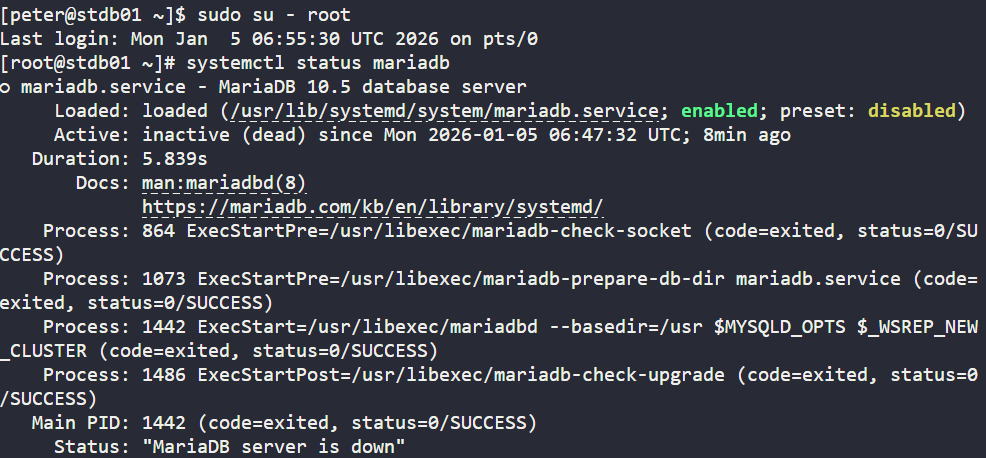
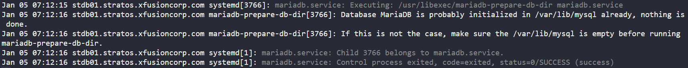
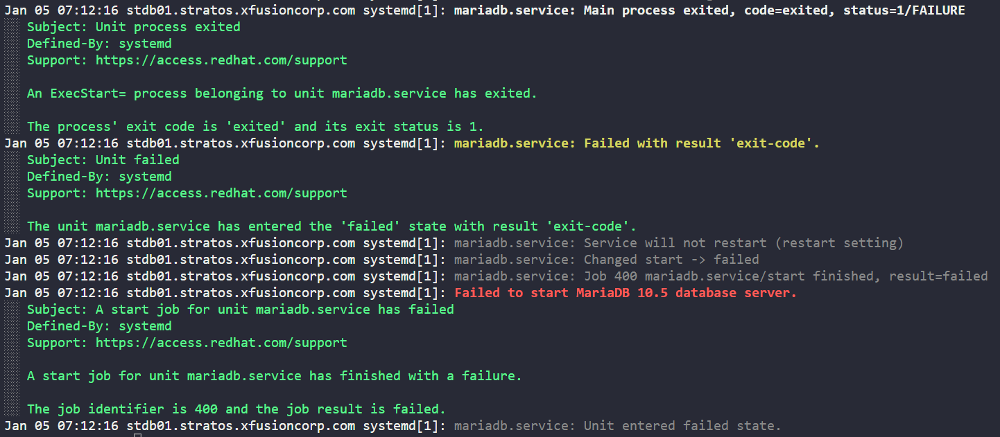
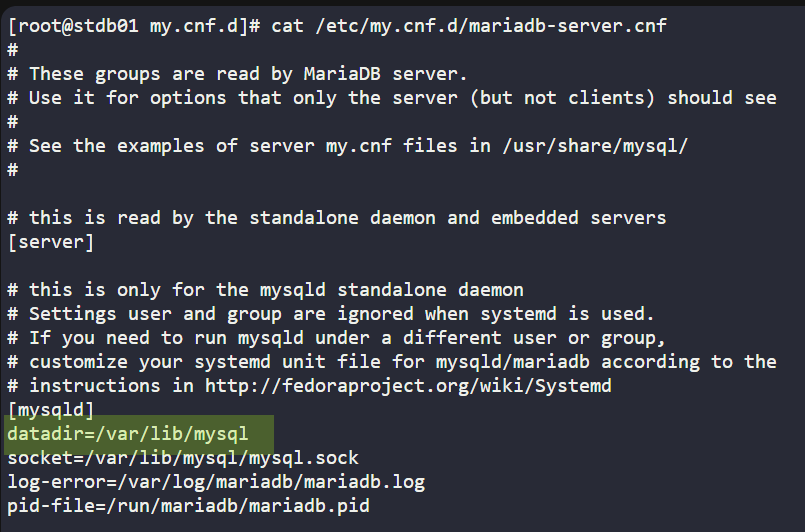
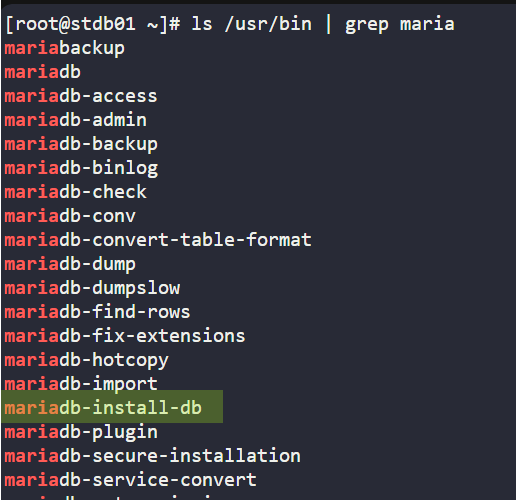
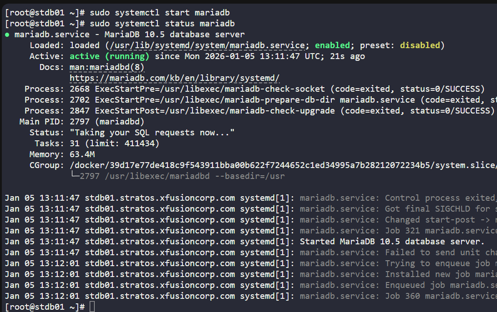
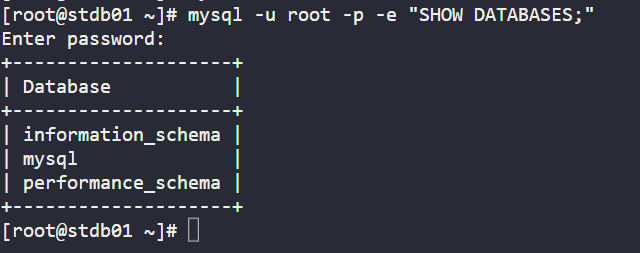

# INCIDENT REPORT
# INCIDENT REPORT: MariaDB Failed to Start Due to Missing Data Directory Initialization

**Date/Time:** 2026-01-03 14:40  
**Service / System:** MariaDB 10.5 / Linux Server  
**Severity:** Critical  
**Reported by:** Agbemuko David Ifeoluwa

---

## 1. Problem
MariaDB failed to start because its data directory was missing system tables, preventing the database service from running.

---

## 2. Symptoms / Alerts
- Systemd logs showed startup failure for MariaDB:
  ```
  mariadbd[xxxx]: InnoDB: Cannot find system tables
  mariadbd[xxxx]: Aborting
  ```
- `systemctl status mariadb` returned:
  ```
  Active: failed (Result: exit-code)
  ```
- Service failed immediately after attempting to start; no socket or PID file created.
- Directory `/var/lib/mysql` existed but contained no database system tables (e.g., `mysql/` schema, `ibdata1`).

---

## 3. Root Cause
The MariaDB data directory `/var/lib/mysql` was either deleted or never initialized. MariaDB does not auto-create or initialize its datadir for security reasons, so the absence of system tables caused the service to fail.

---

## 4. Troubleshooting Steps
1. Checked MariaDB service status:
   ```bash
   systemctl status mariadb
   ```
   
   
2. Reviewed logs in journalctl for MariaDB:
   ```bash
   journalctl -xeu mariadb
   ```
   
   
3. Checked for where the datadir files is located from the database config file in the /etc folder:
   ```bash
   grep -R "datadir" /etc/my.cnf /etc/mysql
   # result: /etc/my.cnf.d/mariadb-server.cnf:datadir=/var/lib/mysql
   ```
   
3. Verified data directory existence, contents, ownership and permissions:
   ```bash
   ls -ld /var/lib/mysql
   ls -l /var/lib/mysql

   result: ls: cannot access '/var/lib/mysql': No such file or directory
   implications: the datadir is missing!
   ```
7. Determined the correct initialization command for MariaDB.

## 5. Resolution / Fix
1. Stop the mariadb service if running
    ```bash
    sudo systemctl stop mariadb
    ```

    this is so at to not confuse the mariadb with the systemd initialization since i am manually initializing with mariadb install.
1. Recreated `/var/lib/mysql` directory (since it was missing) and ensured correct ownership:
   ```bash
   sudo mkdir -p /var/lib/mysql
   sudo chown -R mysql:mysql /var/lib/mysql
   ```
2. Set secure directory permissions:
   ```bash
   sudo chmod 750 /var/lib/mysql
   ```
3. Confirmed the correct initialization command
    ```bash
    ls /usr/bin | grep maria
    ```
    

3. Initialized system tables using the MariaDB-provided tool:
   ```bash
   sudo mariadb-install-db --user=mysql --basedir=/usr --datadir=/var/lib/mysql
   ```

   this is the manual approach
4. Restarted MariaDB service:
   ```bash
   sudo systemctl restart mariadb
   ```

---

## 6. Result / Verification
- MariaDB service started successfully:
  ```bash
  systemctl status mariadb
  ```
  
  ```
  Active: active (running)
  ```
- Verified ownership and permissions:
  ```bash
  ls -ld /var/lib/mysql
  ```
  ```
  drwxr-x---  mysql mysql /var/lib/mysql
  ```
- Confirmed ability to connect to MariaDB and list system databases:
  ```bash
  mysql -u root -p -e "SHOW DATABASES;"
  ```
  

---

## 7. Lessons Learned
- MariaDB does not auto-initialize its data directory by itself (however systemdb does so for it if the datadir is missing); proper initialization must be done manually when datadir is missing.  
- Ownership and permissions are critical; the database service must own all files in its datadir.  
- Always verify datadir content and ownership before attempting service startup.  
---

## 8. Optional Notes
- Verified datadir path in `/etc/my.cnf` matched the initialization command.  
- Be careful not to have systemdb and yourself initializing. that is why for manual initialization, i stop the service first.  
- Alternative workflow (if not manually initializing):
  ```bash
  ls -ld /var/lib/mysql
  sudo chown -R mysql:mysql /var/lib/mysql
  sudo chmod 750 /var/lib/mysql
  systemctl restart mariadb
  ```

